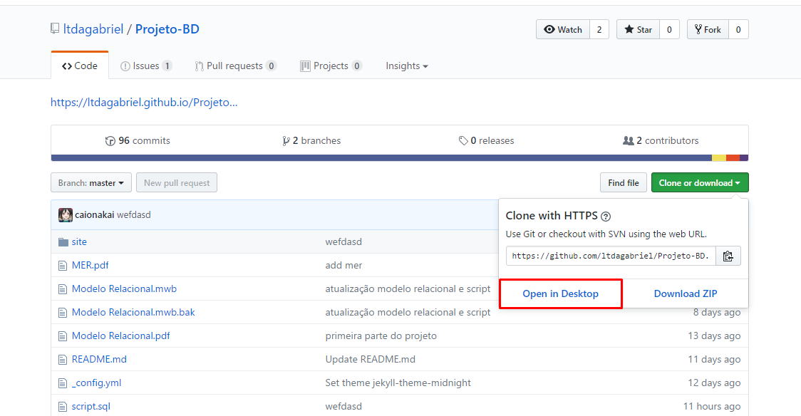
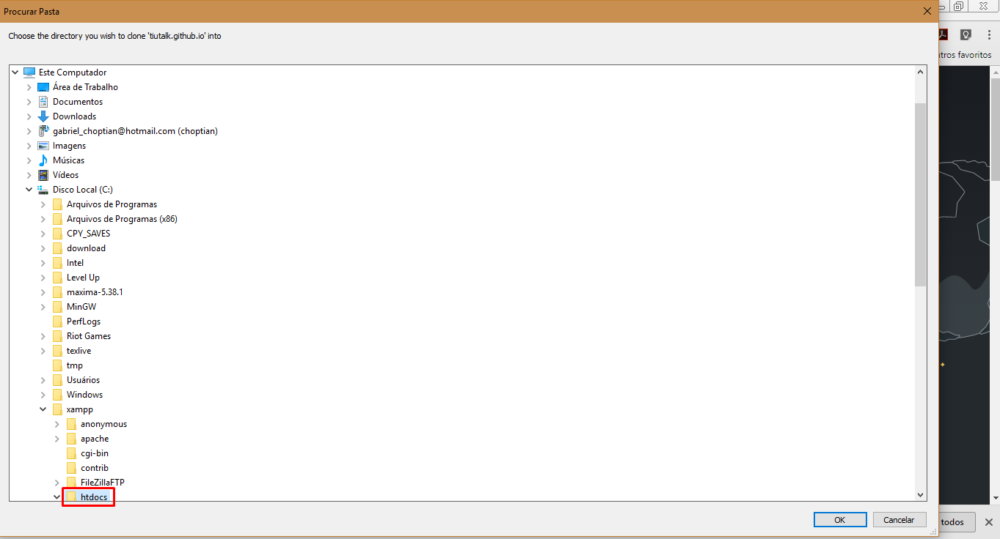
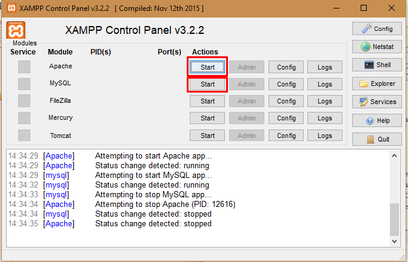
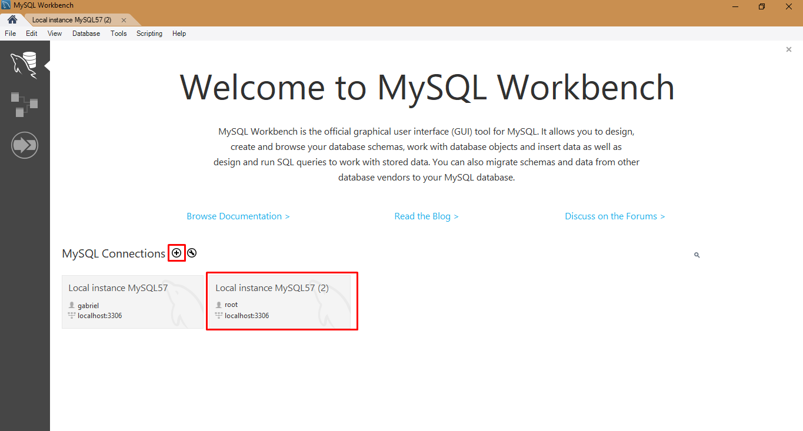
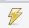
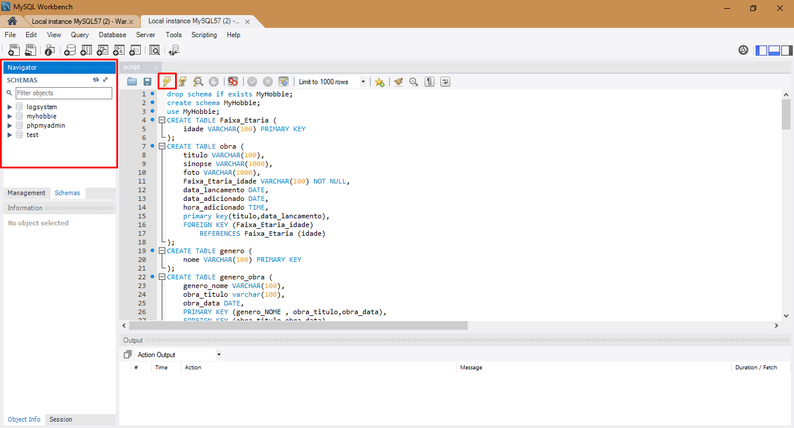

## Projeto BD Passos

- [x] [MER Desenhar](MER.pdf)
- [x] Modelo relacional Usando workbench
- [x] Modelo de 10 relações
- [x] 3 CruD 

## Site Como Testar
Para a utilização de tal sistema é nescessario seguir alguns passos
- Nescessario o [XAMP](https://www.apachefriends.org/pt_br/index.html) para o uso de PHP e MySQL
- Instalar o XAMP em C://, [Exemplo de Instalação](http://www.ambientelivre.com.br/tutoriais-joomla/instalacao-do-xampp-com-o-joomla.html)
- Clonar repositorio utilizando [GitHUB](https://desktop.github.com/) exemplo "Imagem1"
 Imagem1 - Clone Github
- Salvar repositorio na pasta "C:\xampp\htdocs\" assim como na Imagem5
 Imagem5 - Escolhendo a pasta do Clone
- Inicializar os Modulos Apache e MySQL, como mostrado na Imagem2
 Imagem2 - Controle do XAMP
- Abrir [script](script.sql) Utilizando [MySQL Workbench](https://dev.mysql.com/downloads/workbench/)
- verifique se existe uma conexão local:"localhost" com usuario: "root" e sem senha, caso nao tenha adicione uma exemplo para verificaçao Imagem3
 Imagem3 - Conexão Banco e Workbanch
- com o servidor ativo e o script aberto clique no  exemplo Imagem4  
 Imagem4 - Ativar Script no Banco
- pronto agora e so abrir a url:"http://localhost/Projeto-BD/site/" em seu navegador

# Linguagem usada

- [ ] Mysql
- [ ] HTML, CSS, Javascript, framework
- [ ] Java

## Falta

- [ ] Conectar sistema web com banco de dados
- [ ] Modificar dados 
- [ ] retorno de dados
- [ ] Consultas minimo 10
